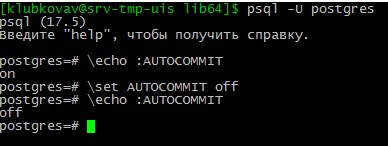

# Отчет по домашке №1
1. зайти удаленным ssh (первая сессия), не забывайте про ssh-add
    1. В качестве платформы для опытов используется виртуальная машина (далее ВМ), развернутая в среде hyper-v
    ВМ на базе ОС Альт8 СП сервер. Выбор сделан такой, поскольку используем данную ОС для работы.
1. зайти удаленным ssh (первая сессия), не забывайте про ssh-add
    1. Для подключения ssh используется putty 
    1. Обновим списки пакетов и установим обновления (обновление ядра и подключение актуального репозитория произведены при установке ОС)
        ```sudo apt-get update``` 
        ```sudo apt-get dist-upgrade```
    1. Установим сервер PostgreSQL в соответствие с документацией к ОС
        * Посмотрим, что есть в дистрибутиве  
            ```sudo apt-cache search postgresql```
        Видим, что в дистрибутиве присутствует postgresql17-server
        * Установим его
            ```apt-get install postgresql17-server  postgresql17-contrib```
        * Создадим кластер 
            ```/etc/init.d/postgresql initdb```
            > Вывод:
           
            Creating default database:
            Файлы, относящиеся к этой СУБД, будут принадлежать пользователю "postgres".
            От его имени также будет запускаться процесс сервера.

            Кластер баз данных будет инициализирован с локалью "ru_RU.UTF-8".
            Кодировка БД по умолчанию, выбранная в соответствии с настройками: "UTF8".
            Выбрана конфигурация текстового поиска по умолчанию "russian".

            Контроль целостности страниц данных отключён.

            исправление прав для существующего каталога /var/lib/pgsql/data... ок
            создание подкаталогов... ок
            выбирается реализация динамической разделяемой памяти... posix
            выбирается значение "max_connections" по умолчанию... 100
            выбирается значение "shared_buffers" по умолчанию... 128MB
            выбирается часовой пояс по умолчанию... Europe/Moscow
            создание конфигурационных файлов... ок
            выполняется подготовительный скрипт... ок
            выполняется заключительная инициализация... ок
            сохранение данных на диске... ок

            initdb: предупреждение: включение метода аутентификации "trust" для локальных подключений
            initdb: подсказка: Другой метод можно выбрать, отредактировав pg_hba.conf или ещё раз запустив initdb с ключом -A, --auth-local или --auth-host.

            Success. You can now start the database server using:

            service postgresql start
        * Запуск службы:
            `systemctl start postgresql`
        * Включение службы по умолчанию:
            `systemctl enable postgresql`
        * Доступ по сети
            `echo "listen_addresses = 'localhost'" >> /var/lib/pgsql/data/postgresql.conf`
    1. Подключимся пользователем postgres

        `psql -U postgres`
    
        
1. зайти вторым ssh (вторая сессия)

    * Создадим второго пользователя ssh
        `sudo useradd klubkovav2`

        `passwd klubkovav2`

        `usermod klubkovav2 -G wheel`
    * Зайдем через putty созданным пользователем.

        
    
    * Подключимся пользователем postgres

        `psql -U postgres`

1. выключить auto commit
    
    `\set AUTOCOMMIT off`

    Проверим

    `\echo :AUTOCOMMIT`

    

1. сделать в первой сессии новую таблицу и наполнить ее данными

    ```SQL
    create table persons(id serial, first_name text, second_name text); 
    insert into persons(first_name, second_name) values('ivan', 'ivanov'); 
    insert into persons(first_name, second_name) values('petr', 'petrov'); 
    commit;

    ```
1. посмотреть текущий уровень изоляции: 
    
    ```SQL
        show transaction isolation level;
    ```

    [read commited](../img/level_isolation.jpg)

1. Начать транзакцию с текущем уровнем изоляции

    `begin;`

1.  в первой сессии добавить новую запись 

        ```SQL
        insert into persons(first_name, second_name) values('sergey', 'sergeev'); 
        select * from persons; 
        ```

1. во второй сессии. видите ли вы новую запись и если да то почему?

       > Мы отключили AUTOCOMMIT и поэтому эта транзакция считается не зафиксированной, а работаем мы в read committed т.е. показываются все записи, которые уже зафиксированны (commit)
    
1. завершить первую транзакцию

    `commit;` 

1. сделать запрос во второй сессии видите ли вы новую запись и если да то почему?
    
        ```SQL
        select * from persons;
        ```

        > Новая запись появилась т.к. мы зафиксировали транзакцию (commit) т.к. работаем мы в read committed т.е. показываются все записи, которые уже зафиксированны (commit)
    
1. Начать новые транзации в repeatable read
    
        ```SQL
        begin;
        set transaction isolation level repeatable read;
        ```
        или

        ```SQL
        begin transaction isolation level repeatable read;
        ```
1. В первой сессии добавить новую запись 
    
        ```SQL
        insert into persons(first_name, second_name) values('sveta', 'svetova'); 
        ```  
    
1. сделать запрос во второй сессии. видите ли вы новую запись и если да то почему?

        ```SQL
            select * from persons;
        ```
    > Новую запись мы не видим т.к. мы работаем мы в repeatable read. Это говорит о том, что в СУБД создан снимок данных на начало транзакции и мы будем видеть только те данные, которые есть, и не будем видеть новые(зафиксированные) данные.
    
1. Завершить первую транзакцию

        ```SQL
        commit;
        ``` 
    
1.  сделать запрос во второй сессии. видите ли вы новую запись и если да то почему?

        ```SQL
            select * from persons;
        ```

    > Новую запись мы не видим т.к. мы работаем мы в repeatable read. Это говорит о том, что в СУБД создан снимок данных на начало транзакции и мы будем видеть только те данные, которые есть, и не будем видеть новые(зафиксированные) данные.

    * Завершить вторую транзакцию. Cделать запрос во второй сессии. видите ли вы новую запись и если да то почему?

        ```SQL
            select * from persons;
        ```
    > Мы видим новую запись т.к. после фиксации транзакции мы переходим в уровень изоляции по умолчанию т.е. в read committed


