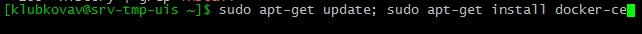
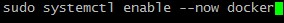
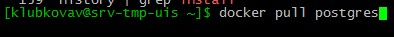

# Отчет по домашке №2

1. установить PostgreSQL в Docker контейнере
    * установим docker,
        `sudo apt-get update; apt-get install docker-ce`
        
    * добавим текущего пользователя в группу docker,
        `sudo usermod -aG docker $USER`
        
    * добавим docker в автозапуск,
        `sudo systemctl eneble --now docker`
        
    * скачиваем контейнер с последним postgres,
        `docker pull postgres`
        
    